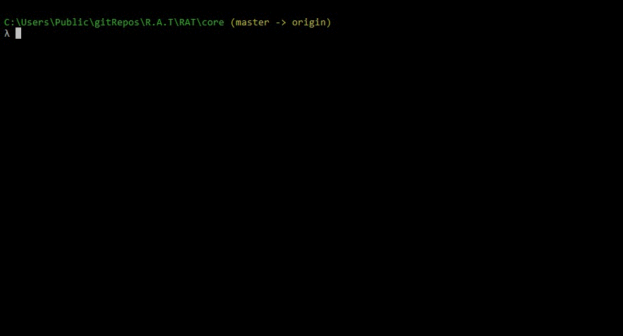
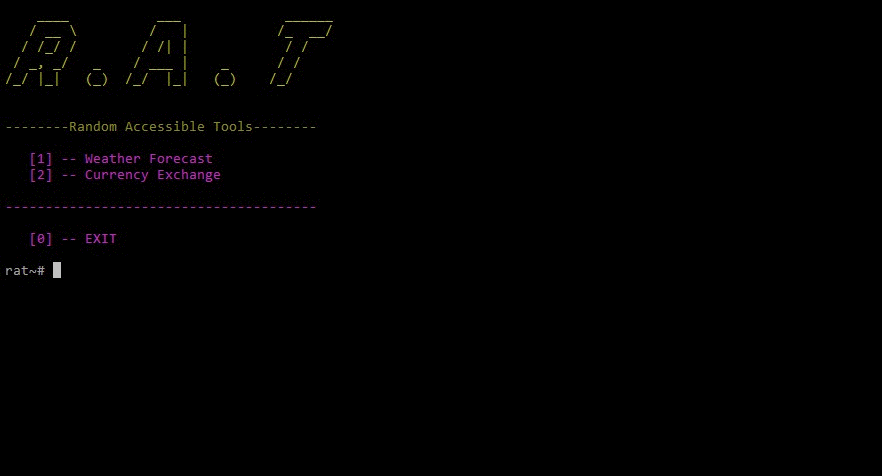

# [W.I.P] R.A.T 

### Random Accessible Tools. 
This is a command line interface that gives access to various tools. 

## Tools
* Weather Forecast
* Currency Exchange

## Installation 
### a. Requirements
Install requirements by typing the following command:

```
pip install -r requirements.txt
```
OR
```
python -m pip install -r requirements.txt
```

## Run
Be inside the core directory and run: 
```
python rat.py
```

## Examples
### Weather Forecast


### Currency Exchange


p.s Not a Remote Access Trojan :)
